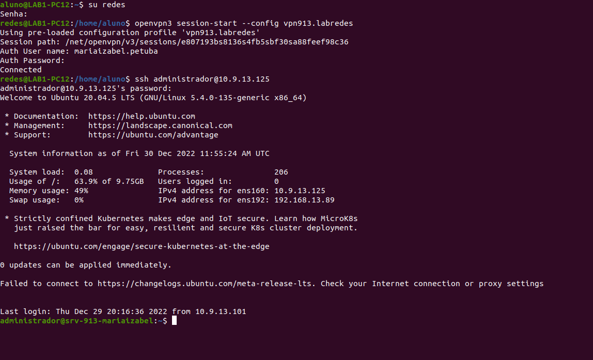
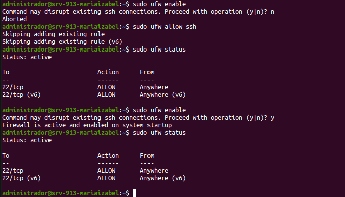

# Configurando o Gateway como NAT

  * Antes de iniciarmos o desenvolvimento do projeto é válido considerar as definições da rede externas ao nosso gateway server  nas tabelas abaixo:
  

Tabela 1: Definições da rede externa: 

  

| DESCRIÇÃO   | IP            |
|:------------|:------------- |
| rede        | 10.0.2.0      |
| máscara     | 255.255.255.0 |
| VirtualBox (gateway)     | 10.0.2.2      |
| Broadcast   | 10.0.2.255    |

   * As definições de rede da rede interna ao gateway server estão exemplificadas na Tabela 2.

 Tabela 2: Definições da rede interna

| DESCRIÇÃO   | IP            |
|:------------|:------------- |
| rede        | 10.0.0.0      |
| máscara     | 255.255.255.0 |
| Gateway     | 10.0.0.1      |
| Broadcast   | 10.0.0.255    |
| NameServer1 | 10.0.0.101     |
| NameServer2 | 10.0.0.120     |
| samba | 10.0.0.132   |

# Configuração do firewall/NAT
 
 Pré-requisito
  * Configurar o firewall no linux;
  
  ## Como habilitar um firewall?
  
   1. Antes de qualquer coisa, precisamos estar logados da forma correta:
     Ao acessar o terminal, provavelmente a primeira coisa que você verá será o mesmo da imagem abaixo:
      
      /imagem do aluno@samba, ou algo assim/
      
      Precisaremos dar o seguinte comando para logarmos no usuário redes: `su redes` , sua senha é :
      
       | Senha: admin@Lab92|
       |-------------------|
      
       
       logo em seguidas devemos acessar nossa vpn:
       
       /imagem de vpn e link para acessar como fazer o acesso do openvpn/
       
       Parte de explicar o ssh do adm no Gw mais a imagem do ssh:
       
       

 Figura 1: Acessar ssh 

   
          

   
 2. habilitar o firewall e permitir o acesso ao ssh:
   Para isso digite o seguinte comando, como exemplifica a imagem:
   
     

 Figura 1: Acessar ssh 

   
          

 3. Alterar os parâmetros do arquivo abaixo. Para isso, remova a marca de comentário (#) da linha em questão, tal qual a figura abaixo:
     `$ sudo nano /etc/ufw/sysctl.conf`
     
      

 Figura 1: Acessar ssh 

   
          
     
  4. Configurando o nome das interfaces: `$ ifconfig -a`
  5. Configurando as interfaces de rede netplan: `$ sudo nano /etc/netplan/50-cloud-init.yaml`
     Deixe sua interface semelhante a da imagem a baixo:
     /imagem/
     
     Depois de verificar que nossa interface está semelhante a da imagem, devemos fazer respetivamente:
       * Ctrl + x, para salvar
       * digitar a letra y (de yes)
       * Clicar na tecla Enter
       
      Logo após, voltaremos a tela anterior digitaremos o seguinte comando para aplicar nossas alterações `$ sudo netplan apply`, em seguida para verificar nossas alterações digitaremos o seguinte comando `% ifconfig -a`;
      
   6. Recriar o arquivo /etc/r.local no ubunto 18.04, com o comando `$ sudo nano /etc/rc.local`
    
    /imagem/
    
   7. Agora devemos alterar o script do arquivo que acessamos no passo anterior:
    
    /imagem de antes/
    
    /imagem de depois/
   
   8. Converter o arquivo em executável e o tornar inicializável no boot, para isso ultiliza o comando `$ sudo chmod 755 /etc/rc.local`
    
    /imagem/
    
   9. Verificar se o nosso firewall está funcionando, para isso você poderá ultizar dois comandos `$ sudo ufw status` ou `$ systemctl status ufw.service`;
    
    /imagem/
    
   10. Devemos ativar Gateway4: 10.0.0.1 nas máquinas SAMBA, NS1 e NS2, para isso devemos usar o comando `$ sudo nano /etc/netplan/50-cloud-init.yaml`
    
    /imaginar/
    
    Deixe sua interface desta maneira:
    
    /imagem/
    
      
    Depois de verificar que nossa interface está semelhante a da imagem, devemos fazer respetivamente:
       * Ctrl + x, para salvar
       * digitar a letra y (de yes)
       * Clicar na tecla Enter
       
     Logo após, voltaremos a tela anterior digitaremos o seguinte comando para aplicar nossas alterações `$ sudo netplan apply`, em seguida para verificar nossas alterações digitaremos o seguinte comando `% ifconfig -a`;
    
   11. Por fim devemos, alterar as portas de acesso externo à serviços de rede interna:
    
     * No SAMBA: devemos permitir que o serviço de compartilhamento esteja disponível de modo exterrno, suas portas são 445 e 139, destacamos que a interface externa usada é WAn, enpOs3 do servidor 10.0.0.100;
      
      /imagem/
      
     * DNS: usa a porta 53, sua interface externa é wan, enpO3ns do servidor 10.0.0.10:
      
      /imagem/
   
    
